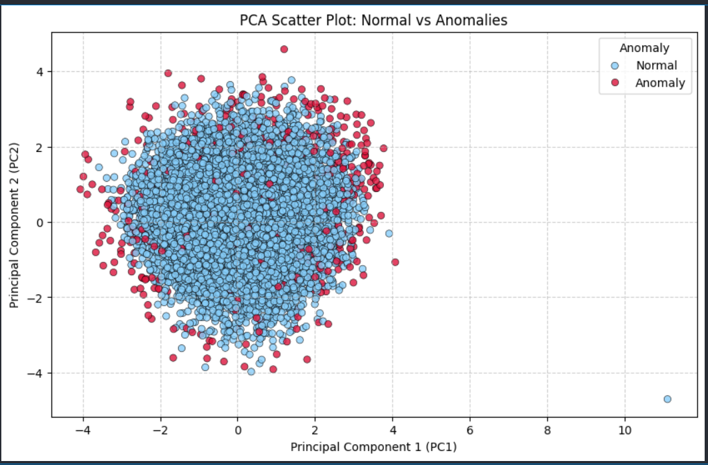

# 🚢 Detecting Anomalous Activity in a Ship's Engine

This repository contains a mini-project focused on detecting anomalies in ship engine sensor data using machine learning techniques. It's part of the CAM101 Week 5 coursework and explores unsupervised anomaly detection models applied to multivariate sensor data.

---

## 📁 Project Structure

```
cam101-week5-mini-project/
├── README.md                          # Project overview and usage guide
├── notebook/
│   └── cam101_week5_project.ipynb    # Main Jupyter Notebook
├── docs/                              # Markdown documentation for each step
│   ├── 01_intro.md
│   ├── 02_data_import.md
│   ├── 03_exploration.md
│   ├── 04_modelling.md
│   ├── 05_results.md
│   └── 06_conclusion.md
├── src/                               # Modular Python scripts
│   ├── data_cleaning.py
│   ├── modeling.py
│   └── visualization.py
├── assets/
|    └── example_plot.png              # Sample plot used in documentation
├──Report.pdf
```

---

## 💡 Project Highlights

- ✅ **Data Import and Preprocessing**: Load engine data, handle missing values, normalize features.
- 📊 **Exploratory Data Analysis**: Distribution plots, box plots, and correlation insights.
- 🧠 **Anomaly Detection Models**:
  - **Isolation Forest**: Tree-based model that isolates anomalies quickly.
  - **One-Class SVM**: Boundary-based model to detect outliers.
- 🔍 **Dimensionality Reduction with PCA**: Visualize high-dimensional data in 2D.
- 📈 **Visualization**: Histograms, box plots, PCA projections, and decision boundaries.

---

## 🔧 How to Use

1. **Clone the Repository**
   ```bash
   git clone https://github.com/yourusername/your-repo-name.git
   cd your-repo-name
   ```

2. **Install Dependencies**
   ```bash
   pip install -r requirements.txt
   ```

3. **Run the Notebook**
   Open `cam101_week5_project.ipynb` from the `notebook/` folder:
   ```bash
   jupyter notebook notebook/cam101_week5_project.ipynb
   ```

4. **Explore the Markdown Docs (Optional)**
   Navigate the `docs/` folder for a modular breakdown of the project pipeline.

---

## 📎 Dataset

- The dataset used (`engine.csv`) contains real-world sensor readings from a ship's engine.
- Includes features such as:
  - Engine RPM
  - Lubricant Oil Pressure
  - Fuel and Coolant Pressure
  - Oil and Coolant Temperature

---

## 📊 Sample Visualization



This KDE plot visualizes the distribution of core engine features, useful for spotting anomalies and skew.

---

## 🤝 Contributions

This project was completed as part of the CAM101 curriculum.

- **Author**: ***Onyeka Muoka***


Feel free to fork and extend for your own anomaly detection projects.

---

## 📄 License

This repository is licensed under the [MIT License](LICENSE).
